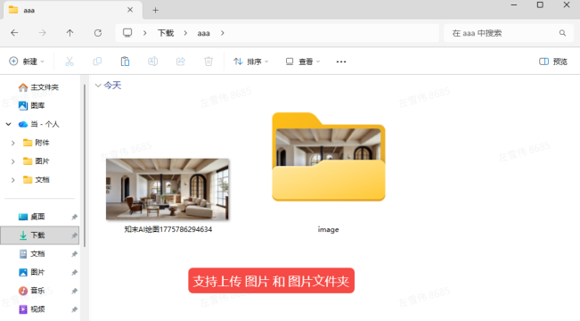
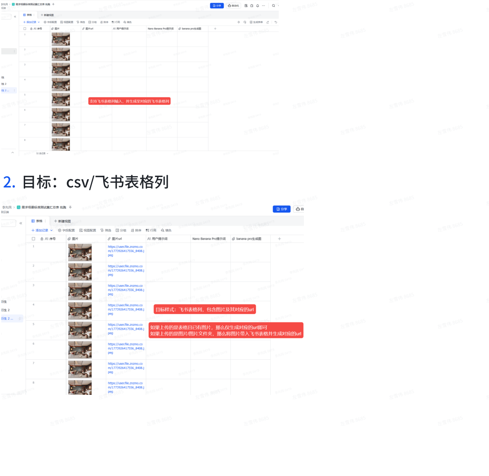
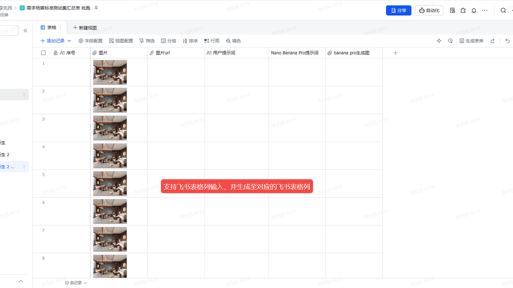
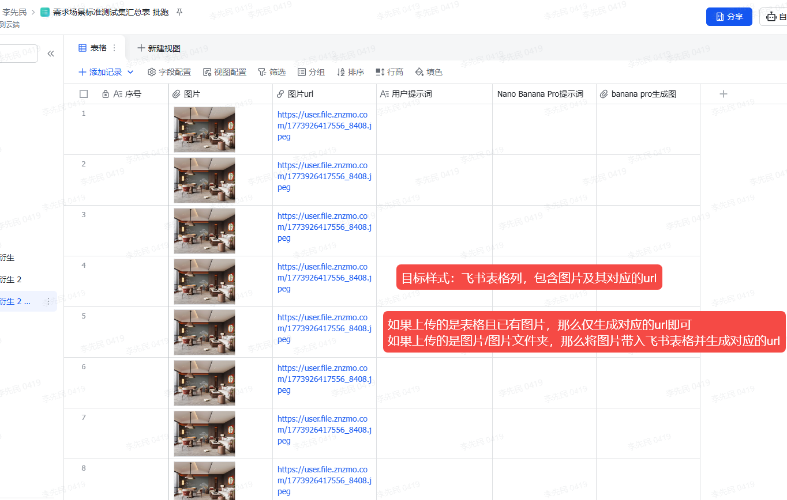

## 图片转url工具需求 

## 一 、需求背景 

为达成 AI 生图业务 80% 优于竞品的核心目标,需构建标准测试集进行批量评测。由于 ComfyUI 批跑 依赖图片 URL,因此需要建设图片批量转 URL 工具以提效。 

## 二、需求目的 

建设图片批量转 URL 工具以提效。 

## 三、变更记录 

|序列号|变更类型|变更时间|变更内容|变更发起人|
|---|---|---|---|---|
|1|PRD初稿|2026-4-10|PRD初稿拟写|李先⺠|
||||||

## 四、需求概览 

- 需求等级:B级 

- 图片批量转 URL 工具 

## 五、需求明细 

## 1. 图片来源:图片/文件夹/⻜书表格列 

**----- Start of picture text -----** 
2. 目标:csv/⻜书表格列 **----- End of picture text -----** 

---

## 附录:提取的图片

